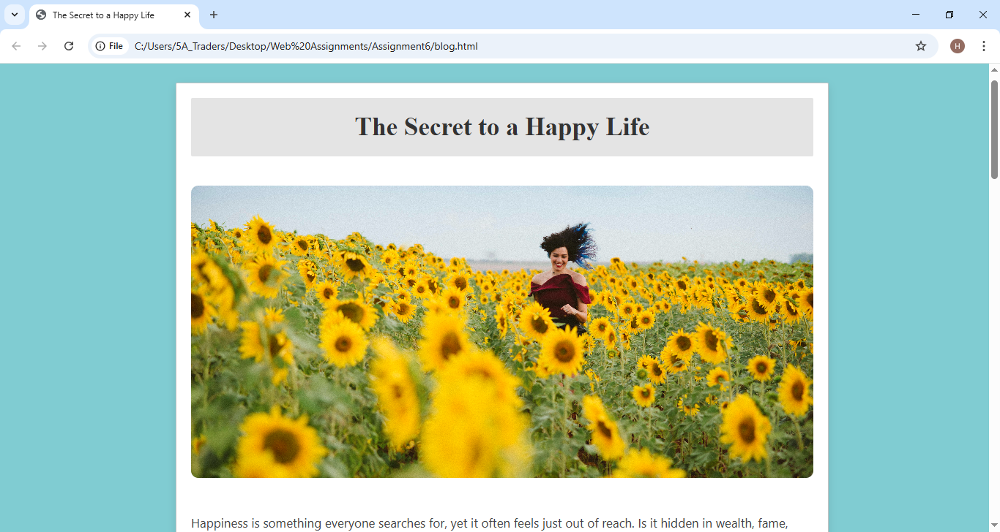

# 📝 The Secret to a Happy Life - Blog

Clean and minimalist blog website featuring lifestyle and wellness content with elegant typography and imagery.

## Features

- **Responsive Layout** - Clean, centered content design with teal-themed borders
- **Hero Image** - Full-width featured image for visual impact
- **Typography** - Elegant serif font for headings and readable body text
- **Content Sections** - Well-structured article layout with proper spacing
- **Minimalist Design** - Focus on content with distraction-free reading experience
- **Color Scheme** - Calming teal and neutral tones

## Content

Blog post exploring the concept of happiness and life fulfillment, discussing whether happiness is found in wealth, fame, relationships, or simple everyday moments.

## Tech Stack

- HTML5
- CSS3
- Responsive Design

## Quick Start

```bash
# Open blog.html in your browser
```
## 📸 Screenshots

### Home Page



